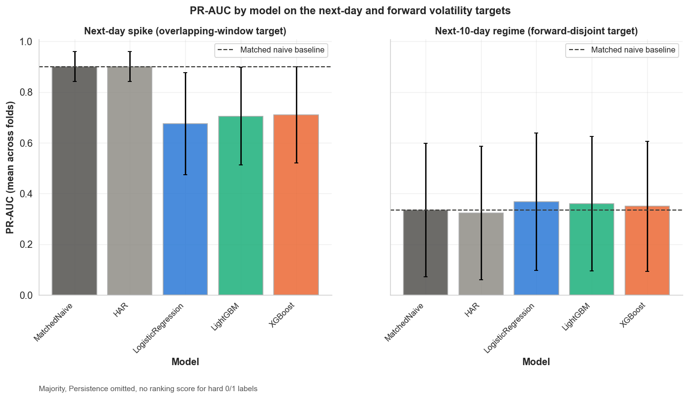

# Forecasting Volatility Regimes in US Equities

A leakage-aware time-series machine learning pipeline for forecasting whether 14 U.S. equities will enter a high-volatility regime over the next 10 trading days.

The analysis uses 37,002 observations from 2015 to 2026 and compares logistic regression, LightGBM, XGBoost, and a HAR benchmark against matched naive baselines under expanding-window validation with horizon-exact purging.

An initial next-day volatility target produced high scores because its feature and label windows overlapped by nine days. Reframing the task around a forward-disjoint 10-day target removed that shortcut and produced a more defensible estimate of out-of-sample forecasting skill. On this target, logistic regression reached 0.368 average precision versus 0.334 for the matched naive baseline, a +0.034 absolute lift that remained significant after accounting for temporal and cross-equity dependence.

> This is a research and educational forecasting study, not a production trading system or investment strategy.



## Separating persistence from predictive skill

The analysis compares two labels built from the same historical per-ticker volatility threshold.

- **`NextVolSpike`** is a negative control. It asks whether tomorrow's 10-day rolling volatility exceeds the threshold, but its label window overlaps the current feature window by nine of ten days. The matched naive rule and HAR both reach average precision near 0.90 and outperform every learned model.
- **`FwdVolRegime`** is the primary target. It asks whether volatility over the next 10 trading days exceeds the threshold. Its label window is disjoint from the current feature window, so performance reflects forward ranking skill rather than a near-restatement of today's regime.

The matched naive baseline flags a regime whenever current volatility already exceeds the same stored threshold used by the labels. It captures the persistence a learned model must beat.

## Results

Forward target, mean across 28 expanding-window folds:

| Model | Precision | Recall | F1 | Average precision |
|---|---:|---:|---:|---:|
| Majority | 0.000 | 0.000 | 0.000 | n/a |
| Persistence | 0.332 | 0.327 | 0.324 | n/a |
| HAR | 0.296 | 0.256 | 0.264 | 0.323 |
| Matched naive | 0.316 | 0.321 | 0.316 | 0.334 |
| XGBoost | 0.328 | 0.440 | 0.362 | 0.350 |
| LightGBM | 0.330 | 0.502 | 0.381 | 0.360 |
| **Logistic regression** | **0.316** | **0.545** | **0.385** | **0.368** |

The exact logistic-regression improvement is **0.0335 average-precision points**. The primary significance analysis resamples complete trading dates in 21-day blocks, keeping the 14 co-moving equities together rather than treating them as independent observations. The 95% interval is **[0.0093, 0.0474]**, with **p=0.0093** and **Holm-adjusted p=0.028** across logistic regression, LightGBM, and XGBoost.

The result is small but defensible. Logistic regression is the only learned model whose lift survives the cross-sectional-aware test and multiple-comparison correction. LightGBM is marginal before correction, XGBoost is not significant, and HAR trails the matched naive rule.

## Leakage controls

Four safeguards prevent the main sources of future information leakage:

1. **Past-only thresholds.** The per-ticker 80th-percentile threshold is computed with `shift(1)`, excluding the present and future.
2. **Disjoint windows.** The primary label measures volatility over `t+1` through `t+10`, separate from the current 10-day rolling-volatility feature window. This drops the correlation between current volatility and the labeled quantity from about 0.96 for the next-day target to about 0.47 for the forward one.
3. **Horizon-exact purging.** Any training row whose label window reaches the test period is removed before fitting.
4. **Train-only scaling.** The logistic-regression scaler is fit separately inside each training fold.

[`tests/test_split.py`](tests/test_split.py) asserts temporal ordering, zero train-test overlap, purge boundaries, incomplete-label handling, minimum training size, and final-fold behavior.

## Robustness and interpretation

A sensitivity grid recomputes the target across 70th, 80th, and 90th percentile thresholds and 5-, 10-, and 21-day horizons. The lift is significant at every tested threshold for the 5-day horizon and at the 70th and 80th percentiles for the 10-day horizon. No tested 21-day configuration is significant.

At a pooled 20% alert budget, logistic regression reaches 0.6226 precision and 0.4651 recall, compared with 0.5285 precision and 0.3948 recall for the matched naive baseline. These are retrospective tradeoffs, not a production alert policy.

The saved logistic-regression model is interpreted through standardized coefficients, while a separate XGBoost model is explained with SHAP on a 2023-onward holdout. VIX and current rolling volatility emerge as stable positive signals across both views. Raw class-weighted scores are not treated as calibrated probabilities.

Full significance, sensitivity, operating-point, explainability, and calibration results are in [`docs/METHODOLOGY.md`](docs/METHODOLOGY.md).

## Reproducing the analysis

```bash
git clone https://github.com/tisyasharma/volatility-regime-forecasting.git
cd volatility-regime-forecasting

make install
make test
make results
make sensitivity_grid
make model
```

`make results` runs evaluation, significance testing, operating-point analysis, and metrics-derived figure generation. The shared `src/` modules contain the reusable analysis logic; the notebooks provide an interactive path through data collection, EDA, modeling, explainability, and calibration.

## Data and scope

The processed dataset contains 37,002 rows for 14 U.S. large-cap equities across six sectors, covering 2015-07-20 through 2026-01-21. Daily OHLCV data and VIX were collected through `yfinance`, and all nine model features are available at time `t`.

See the [`dataset card`](reports/dataset_card.md) for exact tickers, feature definitions, label construction, representation gaps, and data-use constraints. The MIT license applies to the source code, not to the underlying market data or provider terms.

## Limitations

- **Modest effect size.** The best model improves average precision by 0.0335 over the matched naive baseline.
- **Limited breadth.** The universe contains 14 equities across six sectors, including correlated names.
- **Horizon dependence.** The edge is strongest at 5 and 10 trading days and does not remain significant at 21 days.
- **No trading backtest.** Transaction costs, execution, portfolio construction, and risk-adjusted returns are outside the project scope.
- **Calibration drift.** Raw class-weighted scores require new out-of-sample calibration before probability-based use.

## Documentation

- [`docs/METHODOLOGY.md`](docs/METHODOLOGY.md): complete analytical and statistical methodology
- [`reports/model_card.md`](reports/model_card.md): model behavior, intended use, evaluation, and risks
- [`reports/dataset_card.md`](reports/dataset_card.md): provenance, structure, labels, and data-use guidance
