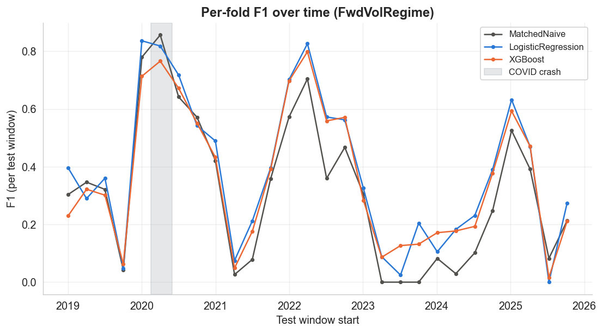

# Methodology and Results

The detailed reasoning, evaluation design, and full results behind the [README](../README.md).
Here we cover why volatility is the target, the model comparison on both targets, dependence-aware
significance, operating points, explainability, calibration, and the leakage controls.

## Choosing volatility over direction

The most common framing for equity prediction is next-day direction, whether the stock rises
or falls tomorrow. The EDA shows that framing offers little predictable signal. Across the 14
tickers, daily returns have almost no autocorrelation, and the direction label carries a
persistent upward drift of 52.8% up-days with no conditional signal beyond it, so direction
modeling was not pursued. That is consistent with the weak form of the efficient market
hypothesis.

Volatility behaves differently here. The autocorrelation of absolute daily returns, the standard
volatility-clustering measure (Cont 2001), sits near 0.236 at a one-day lag in this data and
decays only slowly, while raw returns sit near zero at every lag. A rolling-window measure
would show more, but mostly as an artifact of overlapping windows. That difference defines the
target, **whether the next 10 trading days are a high-volatility regime**, meaning volatility
above its own historical 80th percentile.

## Evaluation design

When a one-line naive rule alone nearly saturates a metric, high scores on it measure
autocorrelation rather than skill. Every model is therefore run against a **matched naive
baseline**, which predicts a regime whenever today's volatility already exceeds the same
per-ticker threshold that defines the label. Two targets are evaluated.

- **NextVolSpike (next-day):** the 10-day rolling volatility at `t` and `t+1` overlap by nine
  days, so this target is close to a restatement of today's regime. It is retained as the
  negative control.
- **FwdVolRegime (next 10 days):** volatility over the next 10 trading days, a window disjoint
  from the features. This is a genuine forecast, and the target the saved model and
  explainability use.

Metrics are precision, recall, F1, and PR-AUC. The label is imbalanced, so accuracy is
misleading. Results are averaged across the walk-forward folds, 28 for the forward target and
29 for the next-day one. The majority and persistence baselines output hard 0/1 labels with no
ranking score, so PR-AUC is undefined for them (shown as n/a), and the majority baseline's
precision is reported as 0.00 by convention.

## Results

Error bars in this figure show one standard deviation of PR-AUC across folds, a dispersion
summary rather than a confidence interval. The paired model-versus-naive tests are in the
significance section below.

**Next-day target.** The matched naive rule and a HAR forecast both reach PR-AUC near 0.90
against a no-skill floor near 0.27, and the learned models sit well below. High scores here
mostly restate today's regime.

| Model | Precision | Recall | F1 | PR-AUC |
|---|---:|---:|---:|---:|
| Majority | 0.00 | 0.00 | 0.00 | n/a |
| Persistence (pooled fixed threshold) | 0.60 | 0.63 | 0.60 | n/a |
| **Matched naive** | **0.87** | **0.88** | **0.87** | **0.90** |
| HAR | 0.87 | 0.87 | 0.87 | 0.90 |
| Logistic Regression | 0.52 | 0.84 | 0.63 | 0.68 |
| LightGBM | 0.52 | 0.89 | 0.64 | 0.70 |
| XGBoost | 0.56 | 0.84 | 0.66 | 0.71 |

**Forward target.** All scores drop toward the base rate because a 10-day-ahead regime is
difficult to forecast, but here the learned models edge above the matched naive baseline.

| Model | Precision | Recall | F1 | PR-AUC |
|---|---:|---:|---:|---:|
| Majority | 0.00 | 0.00 | 0.00 | n/a |
| Persistence (pooled fixed threshold) | 0.33 | 0.33 | 0.32 | n/a |
| HAR | 0.30 | 0.26 | 0.26 | 0.32 |
| Matched naive | 0.32 | 0.32 | 0.32 | 0.33 |
| XGBoost | 0.33 | 0.44 | 0.36 | 0.35 |
| LightGBM | 0.33 | 0.50 | 0.38 | 0.36 |
| **Logistic Regression** | 0.32 | 0.55 | **0.38** | **0.37** |

A ranker with no skill scores a PR-AUC equal to the positive-class share, about 0.27 in the
test windows, and the relevant comparison is the matched naive baseline at 0.33. The lift is
small, so the test is whether it survives dependence-aware significance testing.

## Significance testing

Per-fold metrics are not independent. Volatility clusters in time and the 14 tickers co-move,
so treating the folds as independent draws overstates confidence. A moving-block bootstrap over
folds with an effective-sample-size adjustment (`scripts/significance.py`) tests each model
against the matched naive baseline on the forward target.

The linear model clears the bar. It adds +0.034 PR-AUC over the matched naive baseline, 95% CI
[0.014, 0.061], block-bootstrap p=0.002, holding under the stricter effective-N t-test (t=2.7
on about 21 effective folds). LightGBM (+0.026, p=0.036 at the chosen block length) is
borderline in the block bootstrap and stays marginal under the effective-N test. XGBoost
(+0.016, p=0.23) does not clear it. HAR trails the naive rule (block-bootstrap p=0.04), a
deficit that is itself marginal under the effective-N test (t=-1.9, p about 0.08). These
p-values are unadjusted for the three learned models tested, and under a Holm correction the
linear result stays significant (p=0.0066) while the LightGBM result does not.

That fold-block bootstrap corrects for serial correlation but still counts the 14 co-moving
tickers as independent within each fold. A second bootstrap resamples whole trading dates in
21-day blocks so each drawn date carries its full cross-section, which is the primary reading
(`reports/metrics/significance_crosssectional.csv`). The linear model holds under it at +0.034
PR-AUC, 95% CI [0.009, 0.047], p=0.009, and clears the Holm correction across the three learned
models (p=0.028). Counting the cross-section honestly raises the p-value from 0.002 to 0.009.
LightGBM slips to borderline (p=0.042) and the small HAR deficit is no longer significant
(p=0.10), so the logistic regression is the only model whose edge survives the
cross-sectional-aware test.

## Threshold and horizon sensitivity

The headline fixes the regime at the 80th percentile over a 10-day window, so the edge should be
checked against other choices. `scripts/sensitivity_grid.py` sweeps the quantile over 0.70, 0.80,
and 0.90 and the horizon over 5, 10, and 21 trading days, recomputing the leakage-safe threshold
in each cell so the base rate tracks the quantile and the cells stay comparable. The (0.80, 10)
cell reproduces the headline edge and anchors the grid.

The edge is strongest and significant at the 5-day horizon, above +0.04 at every quantile, and
holds at the 10-day horizon for the 0.70 and 0.80 quantiles, +0.038 and +0.033.
The one 10-day cell that misses significance is the 0.90 quantile, where the regime is rarest
(+0.027, p=0.06), and no cell is significant at the 21-day horizon, where only +0.014 remains at
the headline threshold. The result holds for short horizons at moderate thresholds and should not
be read as horizon-agnostic.

## Operating points

PR-AUC compares rankers without committing to a cutoff, but using the forecast means picking
one. The class-weighted models overstate the regime probability (see Calibration), so instead
of a probability cutoff the comparison spends a fixed alert budget, flagging the top N% of
ticker-days by score (`scripts/operating_points.py`, budgets from 5% to 30% in
`reports/metrics/operating_points.csv`). At a 20% budget the logistic regression catches 47% of
regime ticker-days at 62% precision, against 39% at 53% for the matched naive rule on the same
budget, and it wins on both axes at every budget in the sweep.

The pooled numbers hide dispersion. Alerts concentrate in turbulent stretches and the refit fold
models score on drifting probability scales, so at the 20% cutoff the per-window alert rate runs
from 0% to 98% and false alarms per 63-day window range from 0 to 263 with a median of 30. A
live rule would need a trailing-quantile cutoff rather than these retrospective pooled values.
The table lists candidate tradeoffs, not a tuned operating point, and re-picking a row after
seeing it would be selection on the test set.

## Explainability

`notebooks/03_explainability.ipynb` trains XGBoost on the forward target through 2022 and
computes SHAP on the 2023-onward holdout. The market's implied-volatility gauge, VIX, is the
dominant driver, roughly a third of total attribution in every regime (29% calm, 35% normal,
33% turbulent). Current realized volatility is a clear second in the calm and turbulent thirds,
though it falls to fifth in the normal third. To forecast the regime ten days out, the model
relies on the forward-looking signal. The effect direction is monotonic and economically
sensible, high VIX and high current volatility both push the forecast toward the regime, as the
beeswarm shows. The logistic regression champion is read the same way through its standardized
coefficients. VIX and current volatility take stable positive weights, the same direction as the
SHAP, while the three price-to-moving-average ratios carry large offsetting coefficients that
reflect their near-collinearity rather than standalone importance. That collinearity is why the
tree SHAP, robust to it, ranks VIX and volatility on top instead.

## Calibration

Because the label is imbalanced, calibration matters as much as ranking. All three learned
models are class-weighted for recall, and the two measured on the 2023-onward holdout overstate
the regime probability. XGBoost forecasts 0.37 on average and LightGBM 0.40 against an actual
rate of about 0.17 (Brier 0.18 and 0.19). Isotonic calibration fit on a held-out, purged 2022
slice improves LightGBM's Brier to 0.15, though even the calibrated probabilities sit above the
realized rate because 2022 was far more turbulent than the holdout. Class weighting improves
recall, but a probability that drives a decision should be calibrated first, on unseen data, and
calibration itself inherits regime shift.

## How leakage is prevented

Financial time-series models fail silently when future information leaks into training. Four
safeguards address this.

- **Target threshold uses only the past, and is stored, not re-derived.** The label compares
  future volatility to an expanding 80th-percentile threshold computed with `shift(1)`, so the
  threshold at time `t` never sees volatility at `t` or later. The threshold is computed on the
  full download and persisted in the dataset as `vol_threshold`
  (`scripts/verify_vol_threshold.py`), so the labels, the matched naive baseline, and HAR all
  use the exact same values (`notebooks/00_data_collection.ipynb`, `src/targets.py`).
- **Feature and label windows do not overlap.** The primary target measures volatility over the
  next 10 days, disjoint from the 10-day feature window, so the target is a forecast rather than
  a restatement of a feature. The mean per-ticker correlation between them falls from ~0.96 for
  the next-day target to ~0.47 for the forward one, and the pooled correlation from ~0.97 to
  ~0.61.
- **Walk-forward validation with a horizon-exact purge.** Training is an expanding window. Each
  63-trading-day test window starts after its training window with no overlap or shuffling, and
  the purge drops any training row whose forward-label window would reach into the test period
  (López de Prado, 2018), enforced in trading days and matched to each target's horizon, so it
  is holiday-proof. A separate embargo step is unnecessary because the expanding walk-forward
  never trains on data that follows a test window. The purge lives in the split machinery
  (`src/split.py`), so the evaluation driver and the modeling notebook share one implementation,
  and `tests/test_split.py` asserts the invariants. Notebook 03 applies the same label-end rule
  inline for its holdout and calibration splits.
- **Scaling fits on training data only.** The logistic regression scaler is fit on the train
  fold and applied to the test fold (`src/modeling.py`).

## Limitations

- **The lift is modest.** About 0.03 PR-AUC over the matched naive baseline for the best model,
  statistically significant (see Significance testing) but small. This is a hard forecasting
  problem.
- **Cross-sectional dependence is now in the interval, breadth is still limited.** The primary
  significance uses a date-block bootstrap that resamples whole trading dates, so the 14 co-moving
  tickers count as one cross-section rather than 14 independent draws (see Significance testing).
  The 14 names span six sectors with correlated airlines, so effective breadth is well below 14
  and a wider universe would sharpen the test.
- **The final fold is short.** The last test window covers the 9 trading days remaining at the
  end of the sample, kept so the newest data is still evaluated. For the next-day target it
  carries the same weight as a full fold in the fold-mean. The last day of the final full window
  similarly drops out of the forward target because its label window extends past the data.
- **No trading cost model.** This is a forecasting study, not a backtest of a tradable system net
  of transaction costs, slippage, or borrow.
- **The edge is horizon-specific.** The headline uses the 80th percentile over a 10-day window.
  The sensitivity grid holds for 5 and 10-day horizons at moderate thresholds and fades toward the
  21-day horizon, so the finding is specific to short horizons rather than general.
- **US large caps only.** Findings may not transfer to other asset classes or market caps.
