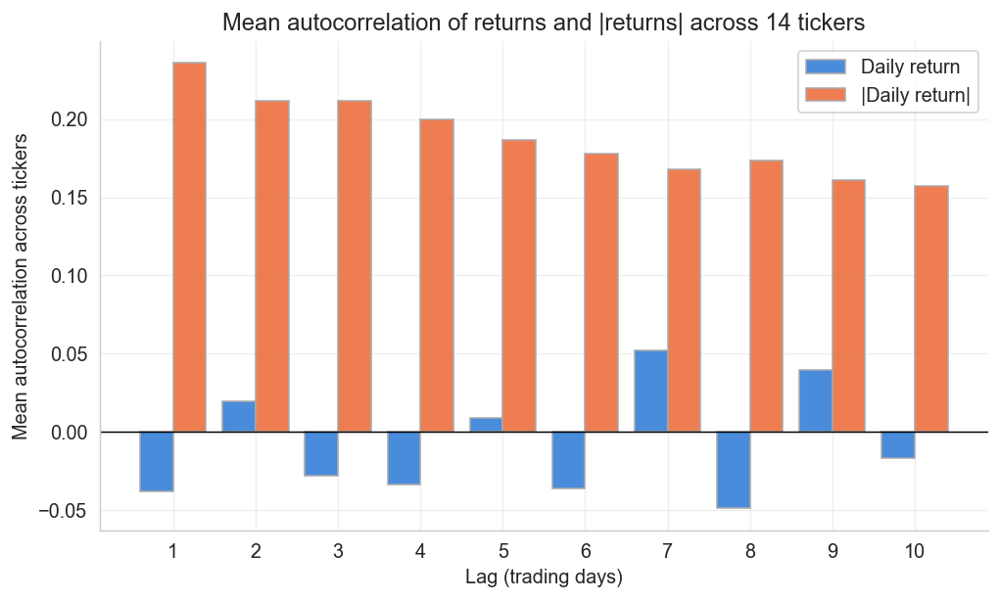
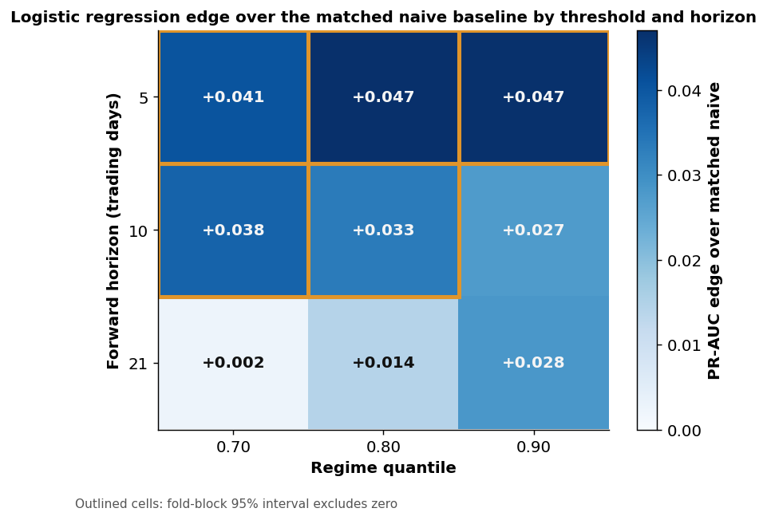
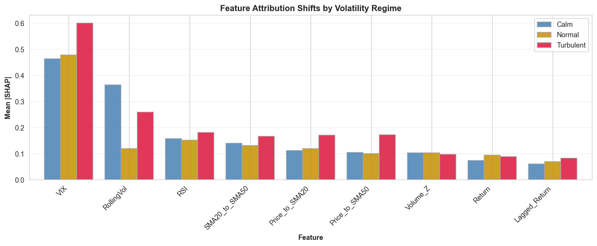
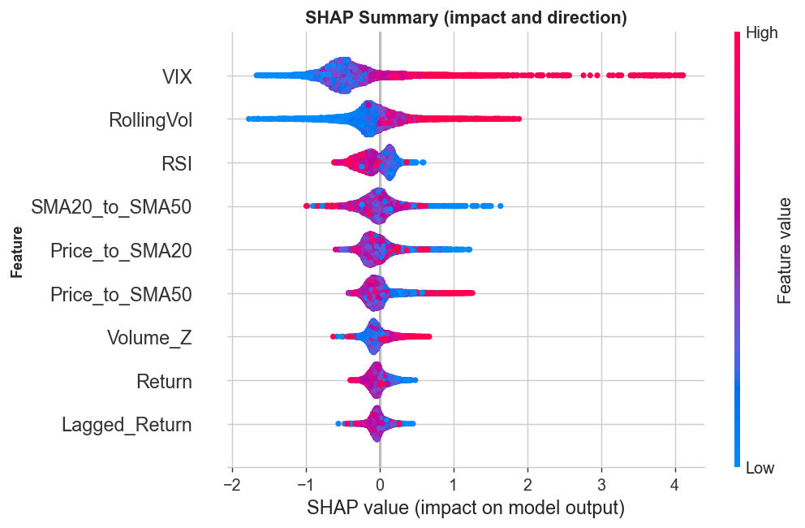
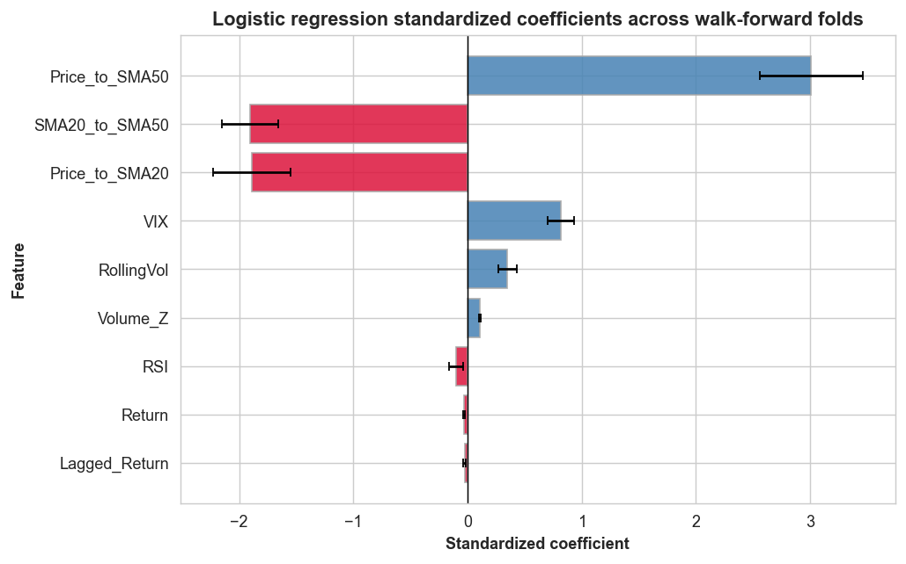
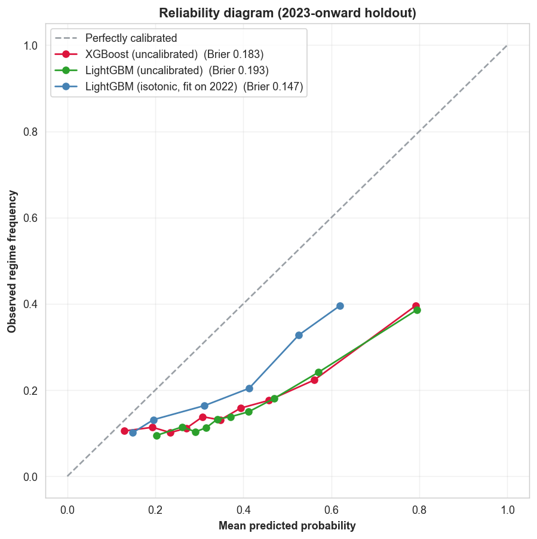

# Methodology and Results

This document provides the complete analytical rationale, validation design, results, and limitations behind the [project README](../README.md).

The study asks whether information available at the close of trading day `t` can rank which equity-days will enter a high-volatility regime over the next 10 trading days, once overlapping windows, naive persistence, temporal dependence, and cross-sectional co-movement are handled explicitly.

## 1. Study motivation

The initial exploratory analysis considered next-day return direction. Across the 14 equities, the direction label is positive on 52.8% of observations, reflecting a persistent upward drift, while raw daily returns show little serial dependence that would support a useful conditional forecast.

Volatility behaves differently. Absolute daily returns have positive short-lag autocorrelation, around 0.24 at a one-day lag and slow to decay, consistent with volatility clustering (Cont, 2001). That persistence motivates a volatility target, but it also creates the main methodological risk: a model can appear predictive when the target largely repeats information already present in the feature window.



The project therefore treats target construction and baseline selection as part of the forecasting problem rather than as preprocessing details.

## 2. Data and features

The processed dataset contains **37,002 model-ready equity-day observations** from **2015-07-20 through 2026-01-21** across 14 U.S. equities:

- technology: AAPL, MSFT, AMZN, GOOGL, NVDA, TSLA;
- finance: JPM;
- retail: WMT;
- airlines: DAL, UAL;
- defense: LMT, RTX, NOC;
- energy: XOM.

Daily OHLCV data and VIX were collected through `yfinance`. Nine features are used, all known at time `t`:

1. `Return`
2. `RollingVol`
3. `RSI`
4. `Price_to_SMA20`
5. `Price_to_SMA50`
6. `SMA20_to_SMA50`
7. `Volume_Z`
8. `VIX`
9. `Lagged_Return`

The complete provenance, raw and processed row counts, label definitions, and representation gaps are documented in the [dataset card](../reports/dataset_card.md).

## 3. Regime threshold and prediction targets

A per-ticker expanding 80th-percentile threshold defines a high-volatility regime. The threshold is computed from historical `RollingVol` values with `shift(1)` and a minimum history of 126 observations. The threshold at time `t` therefore excludes volatility from `t` and all future dates.

The result is persisted as `vol_threshold` in the raw and processed datasets. Target construction, the matched naive baseline, and the HAR benchmark reuse this stored column. Persisting it prevents downstream code from silently recalculating the threshold on a warm-up-trimmed or evaluation-specific sample.

Two targets are evaluated.

### `NextVolSpike`: overlapping negative control

`NextVolSpike` is positive when tomorrow's 10-day rolling volatility exceeds the stored threshold. The rolling-volatility windows at `t` and `t+1` share nine of ten daily returns. This target is retained to demonstrate how window overlap can convert persistence into an apparently strong prediction task.

The full-sample positive rate is approximately 25.2%.

### `FwdVolRegime`: forward-disjoint primary target

`FwdVolRegime` is positive when volatility over the next 10 trading days exceeds the same stored threshold. The future window covers `t+1` through `t+10` and is disjoint from the current 10-day rolling-volatility feature window. The correlation between current rolling volatility and the labeled quantity falls from 0.957 for the overlapping next-day target to 0.471 for this forward target, so performance reflects forward ranking rather than a near-restatement of a feature.

The full-sample positive rate is approximately 25.4%. This is the target used for model selection, the saved artifact, sensitivity analysis, and the primary interpretation.

## 4. Models and baselines

All models are trained and evaluated through shared code paths in `src/modeling.py`.

### Baselines and benchmark

- **Majority:** always predicts the majority class.
- **Persistence:** predicts a regime when current `RollingVol` exceeds a pooled 80th-percentile threshold estimated from the training fold. It outputs hard labels and is evaluated with precision, recall, and F1 only.
- **Matched naive:** predicts a regime when current volatility already exceeds the same stored per-ticker threshold used by the label. Its continuous ranking score is `RollingVol / vol_threshold`.
- **HAR:** an econometric volatility benchmark in the spirit of HAR-RV (Corsi, 2009). It uses current 10-day rolling volatility and its trailing 5- and 22-day means, then compares the forecast with the same stored threshold used by the target.

The matched naive rule is the primary baseline because it captures current volatility persistence on the same threshold definition as the label.

### Learned models

- logistic regression with balanced class weights and a training-fold-only `StandardScaler`;
- LightGBM with balanced class weights;
- XGBoost with `scale_pos_weight` derived from the class ratio in each training fold.

Hyperparameters are centralized in [`config.yaml`](../config.yaml). Random seed 42 is used for the learned models.

## 5. Walk-forward validation

The primary evaluation uses expanding-window walk-forward validation:

- training begins on 2015-07-20;
- the initial training period ends on 2018-12-31;
- each full test window spans 63 trading days;
- test windows do not overlap;
- training expands after every fold;
- the forward target produces 28 usable folds;
- the next-day target produces 29 usable folds, including a final nine-trading-day partial window.

### Horizon-exact purge

Each row stores the trading date on which its label window ends. Before a fold is fit, the purge removes every training row whose label window reaches the test period (López de Prado, 2018). This prevents training labels from containing returns observed during the test window.

The purge is implemented in `src/split.py` and called by `scripts/run_evaluation.py`. [`tests/test_split.py`](../tests/test_split.py) asserts:

- temporal ordering;
- zero train-test row overlap;
- exact purge boundaries;
- exclusion of incomplete labels;
- minimum training-window size;
- handling of the final partial fold;
- agreement between target label-end dates and split logic.

A separate embargo after the test window is unnecessary because the expanding design never trains on observations that follow an earlier test window.

### Train-only preprocessing

The logistic-regression scaler is fitted on each training fold and then applied to the corresponding test fold. Test observations do not influence the scaling parameters.

## 6. Evaluation metrics

The target is imbalanced, so accuracy is not used as a primary metric. Reported metrics are precision, recall, F1, and **average precision (AP)**.

The metric field remains named `pr_auc` in the existing CSV files and plots, but the implementation computes it with scikit-learn's `average_precision_score`. Average precision is therefore the technically exact term used in this documentation.

Majority and persistence produce hard labels without a continuous ranking score. AP is reported as `n/a` for those models rather than being calculated from fabricated probabilities.

## 7. Model comparison


The figure's error bars show one standard deviation across walk-forward folds. They summarize dispersion and are not confidence intervals.

### Next-day negative control

| Model | Precision | Recall | F1 | Average precision |
|---|---:|---:|---:|---:|
| Majority | 0.0000 | 0.0000 | 0.0000 | n/a |
| Persistence | 0.5988 | 0.6273 | 0.6009 | n/a |
| **Matched naive** | **0.8709** | **0.8752** | **0.8729** | **0.9008** |
| HAR | 0.8742 | 0.8684 | 0.8711 | 0.9008 |
| Logistic regression | 0.5235 | 0.8376 | 0.6307 | 0.6762 |
| LightGBM | 0.5203 | 0.8875 | 0.6392 | 0.7050 |
| XGBoost | 0.5597 | 0.8418 | 0.6567 | 0.7100 |

The matched naive rule and HAR both reach AP near 0.90 and outperform every learned model. Because the current and next-day rolling-volatility windows share nine returns, this result primarily measures overlap and persistence rather than genuine forward skill.

### Forward-disjoint target

| Model | Precision | Recall | F1 | Average precision |
|---|---:|---:|---:|---:|
| Majority | 0.0000 | 0.0000 | 0.0000 | n/a |
| Persistence | 0.3324 | 0.3271 | 0.3238 | n/a |
| HAR | 0.2956 | 0.2563 | 0.2644 | 0.3226 |
| Matched naive | 0.3157 | 0.3213 | 0.3155 | 0.3342 |
| XGBoost | 0.3276 | 0.4400 | 0.3620 | 0.3499 |
| LightGBM | 0.3300 | 0.5017 | 0.3805 | 0.3604 |
| **Logistic regression** | **0.3164** | **0.5450** | **0.3849** | **0.3677** |

The mean positive-class prevalence across forward test windows is approximately 0.27, which is the expected AP of an unskilled ranker. The matched naive baseline at 0.3342 is the more informative comparison because it represents the persistence already available at time `t`.

Logistic regression improves AP by **0.0335** over that baseline.

## 8. Dependence-aware inference

Per-fold scores are not independent. Volatility clusters over time, and the 14 equities co-move. Two resampling analyses test each model's AP edge over the matched naive baseline.

### Fold-block bootstrap

A moving-block bootstrap over ordered folds addresses serial dependence across test windows. An effective-sample-size adjustment provides an additional serial-correlation check.

| Model | AP edge | 95% block-bootstrap CI | Block-bootstrap p |
|---|---:|---:|---:|
| Logistic regression | 0.0335 | [0.0136, 0.0605] | 0.0022 |
| LightGBM | 0.0262 | [0.0019, 0.0596] | 0.0358 |
| XGBoost | 0.0156 | [-0.0139, 0.0522] | 0.2301 |
| HAR | -0.0116 | [-0.0219, -0.0006] | 0.0395 |

Logistic regression remains significant after Holm correction across the three learned models, with adjusted p=0.0066. LightGBM does not remain significant after correction.

This analysis corrects serial dependence but still treats the cross-section within each fold too optimistically.

### Date-block bootstrap

The primary inference resamples complete trading dates in 21-day blocks. Each sampled date carries its full cross-section of equities, so the 14 co-moving names are not counted as independent observations.

| Model | AP edge | 95% date-block CI | Unadjusted p |
|---|---:|---:|---:|
| Logistic regression | 0.0335 | [0.0093, 0.0474] | 0.0093 |
| LightGBM | 0.0262 | [0.0013, 0.0452] | 0.0420 |
| XGBoost | 0.0156 | [-0.0082, 0.0331] | 0.2047 |
| HAR | -0.0116 | [-0.0251, 0.0023] | 0.1033 |

The primary logistic-regression comparison uses 24,682 out-of-fold rows across 1,763 distinct trading dates and 3,000 bootstrap resamples.

After Holm correction across logistic regression, LightGBM, and XGBoost:

- logistic regression remains significant at adjusted p=0.028;
- LightGBM does not remain significant;
- XGBoost is not significant.

Logistic regression is therefore the only learned model whose improvement survives both the primary cross-sectional-aware test and multiple-comparison correction.

## 9. Threshold and horizon sensitivity

The headline target uses an 80th-percentile threshold and a 10-trading-day horizon. `scripts/sensitivity_grid.py` recomputes the leakage-safe target and matched naive baseline for thresholds at the 70th, 80th, and 90th percentiles and horizons of 5, 10, and 21 trading days.



| Threshold | Horizon | Logistic AP | Naive AP | AP edge | 95% CI | p |
|---:|---:|---:|---:|---:|---:|---:|
| 0.70 | 5 | 0.4938 | 0.4533 | 0.0405 | [0.0218, 0.0659] | 0.0002 |
| 0.80 | 5 | 0.3773 | 0.3303 | 0.0470 | [0.0254, 0.0735] | 0.0003 |
| 0.90 | 5 | 0.2376 | 0.1908 | 0.0468 | [0.0198, 0.0617] | 0.0001 |
| 0.70 | 10 | 0.4980 | 0.4603 | 0.0377 | [0.0164, 0.0625] | 0.0008 |
| 0.80 | 10 | 0.3678 | 0.3344 | 0.0334 | [0.0138, 0.0609] | 0.0018 |
| 0.90 | 10 | 0.2347 | 0.2072 | 0.0274 | [-0.0011, 0.0504] | 0.0611 |
| 0.70 | 21 | 0.4886 | 0.4863 | 0.0023 | [-0.0213, 0.0273] | 0.7039 |
| 0.80 | 21 | 0.3588 | 0.3446 | 0.0142 | [-0.0047, 0.0387] | 0.1290 |
| 0.90 | 21 | 0.2204 | 0.1923 | 0.0281 | [-0.0081, 0.0568] | 0.1191 |

The edge is consistently significant at the 5-day horizon. It remains significant at the 10-day horizon for the 70th and 80th percentile thresholds, but not for the rarer 90th percentile. No 21-day configuration reaches significance.

The result should therefore be interpreted as a short-horizon finding rather than a general volatility signal at arbitrary horizons.

## 10. Operating points

Average precision evaluates ranking quality without selecting a cutoff. A practical alert system would still need to decide how many equity-days to flag.

Because class-weighted model outputs are not well calibrated, `scripts/operating_points.py` compares score-quantile alert budgets from 5% through 30% instead of treating raw scores as probabilities.

At a pooled 20% alert budget:

| Model | Precision | Recall | F1 |
|---|---:|---:|---:|
| Logistic regression | 0.6226 | 0.4651 | 0.5325 |
| Matched naive | 0.5285 | 0.3948 | 0.4519 |

Logistic regression has higher precision and recall than the matched naive rule at every tested pooled budget.

These values are retrospective comparisons, not a selected production threshold. At the pooled 20% cutoff, logistic-regression alert rates vary from 0% to 98.07% across folds, with a median of 5.44%. False positives range from 0 to 263 per test window, with a median of 30. A live alert system would require a trailing or fold-local threshold and prospective validation.

## 11. Explainability

The champion logistic-regression model is interpreted through standardized coefficients across walk-forward folds. VIX and current rolling volatility receive stable positive weights. The three price-to-moving-average ratios carry large offsetting coefficients, consistent with their strong collinearity rather than independent effects.

`notebooks/03_explainability.ipynb` also trains XGBoost through 2022 and computes SHAP values on a 2023-onward holdout. XGBoost is used for nonlinear supporting analysis rather than as a substitute explanation for the logistic-regression champion.

Across the holdout:

- VIX is the dominant SHAP feature, accounting for roughly one-third of total attribution in each observed volatility regime (29% calm, 35% normal, 33% turbulent);
- current rolling volatility is a clear second in the calm and turbulent thirds but falls to fifth in the normal third, behind the technical ratios;
- high VIX and high current volatility push predictions toward the high-volatility class.







SHAP values explain XGBoost's behavior only. They are supporting evidence about nonlinear feature use, not an attribution of the saved logistic-regression model.

## 12. Calibration

The learned models use class weighting to improve minority-class recall. Their raw outputs are not assumed to be calibrated probabilities.

On the 2023-onward holdout, XGBoost predicts a mean regime probability of approximately 0.37 and LightGBM approximately 0.40, compared with an observed rate near 0.17. Their Brier scores are approximately 0.18 and 0.19. Isotonic calibration fitted on a separate purged 2022 slice improves LightGBM's Brier score to approximately 0.15, but the calibrated output still reflects market-regime shift between the calibration and evaluation periods.



The project therefore emphasizes ranking metrics and fixed alert budgets. Any probability-based use would require new prospective calibration on unseen data.

## 13. Limitations

- **Modest effect size.** The primary AP lift is 0.0335 over the matched naive baseline. Statistical significance does not make the forecasting advantage large.
- **Limited cross-sectional breadth.** The date-block bootstrap accounts for co-movement in the interval estimate, but the universe contains only 14 equities across six sectors, including correlated airline names.
- **Short final next-day fold.** The negative-control target includes a final nine-trading-day test window that receives the same weight as a full fold in fold-mean summaries. Incomplete forward-target labels are excluded.
- **No trading-cost model.** Transaction costs, slippage, borrow, execution, portfolio construction, and risk-adjusted returns are not evaluated.
- **Horizon-specific result.** The edge is strongest at 5 and 10 trading days and does not remain significant at 21 days.
- **U.S. large-cap scope.** The results may not transfer to smaller equities, international markets, other asset classes, or substantially different future regimes.
- **Calibration drift.** Probability calibration is sensitive to the market period used to fit the calibrator.
- **Research artifact.** The saved model supports reproduction and inspection. It is not a live trading or automated-decision system.

## 14. Reproducibility

```bash
make install
make test
make results
make sensitivity_grid
make model
```

`make results` runs evaluation, significance testing, operating-point analysis, and metrics-derived figure generation. SHAP and calibration figures are generated by `notebooks/03_explainability.ipynb`.

Machine-readable sources for the headline results:

- `reports/metrics/walkforward_summary.csv`
- `reports/metrics/significance.csv`
- `reports/metrics/significance_crosssectional.csv`
- `reports/metrics/sensitivity_grid.csv`
- `reports/metrics/operating_points.csv`
- `reports/metrics/oof_predictions.csv`

Related documentation:

- [README](../README.md)
- [Model card](../reports/model_card.md)
- [Dataset card](../reports/dataset_card.md)
