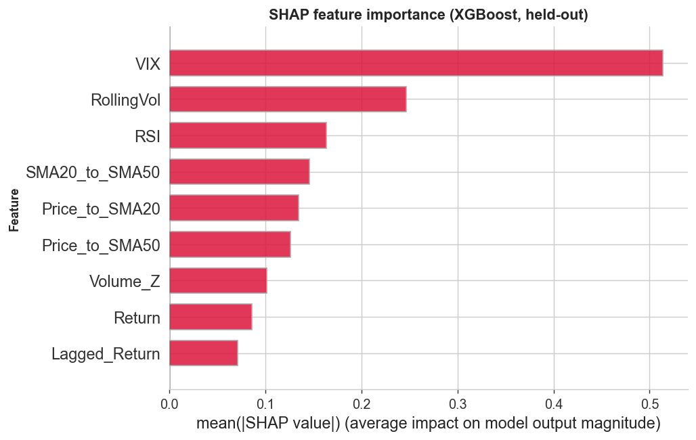

# Model Card

## Model summary

- Model name: Forward volatility-regime classifier
- Version: 2.1
- Task: Binary classification of whether the next 10 trading days are a high-volatility regime
  for US equities (`FwdVolRegime`). A next-day target (`NextVolSpike`) is also
  evaluated as a reference case. A matched naive rule beats every learned model on it.
- Saved artifact: logistic regression with its standard scaler
  (`models/artifacts/final_model_fwdvolregime.joblib`), selected because it has the top
  walk-forward PR-AUC and the only edge over the matched naive baseline that clears both
  dependence-aware significance tests.
- Context of use: Research and educational forecasting study, not a production trading system

## Intended uses

- Supported uses: studying volatility clustering, comparing models under a leakage-aware
  expanding-window walk-forward, teaching time-series evaluation methodology.
- Out-of-scope uses: live trading, investment advice, or any decision that assumes the
  forecasts are net of transaction costs. No cost or execution model is included.

## Training data

- Datasets used: `data/processed/merged_features_clean.csv` (37,002 rows, 14 tickers).
- Sampling window: 2015-07-20 to 2026-01-21.
- Primary target: `FwdVolRegime`, defined as volatility over the next 10 trading days (a window
  disjoint from the features) exceeding an expanding 80th-percentile threshold computed on past
  volatility only. The threshold is persisted as `vol_threshold` (see dataset card). Positive
  class rate ~25.4%. `NextVolSpike` (next-day, ~25.2%) is retained as a
  demonstration target.
- Known gaps or biases: US large caps across six sectors only. The airline names are highly
  correlated, so effective breadth is below 14 independent series.

## Training procedure

- Preprocessing: technical indicators expressed as scale-free ratios and z-scores. Logistic
  regression standardizes features with a scaler fit on the training fold only.
- Models: majority and persistence baselines, a matched naive baseline (defined in
  `docs/METHODOLOGY.md`), and a HAR-style econometric benchmark in the spirit of Corsi (2009) (OLS on the
  current 10-day rolling volatility and its trailing 5- and 22-day means, the
  daily/weekly/monthly cascade, thresholded identically, with the 10-day rolling std standing in
  for the intraday realized volatility of classic HAR-RV). The learned models are logistic regression, LightGBM,
  XGBoost.
- Hyperparameters: defined in `config.yaml` (for example LightGBM uses 200 trees, learning
  rate 0.05, max depth 5, balanced class weights). Every learned model handles the class
  imbalance on equal terms. Logistic regression and LightGBM use balanced class weights, and
  XGBoost derives `scale_pos_weight` from the training class ratio at fit time.
- Framework: scikit-learn, LightGBM, XGBoost.
- Random seed: 42 for all learned models.

## Evaluation

- Validation protocol: expanding-window walk-forward with 28 folds on the forward target (29
  for the next-day target, including a short 9-day final window kept so the newest data is
  evaluated). Training starts 2015-07-20 and grows. Each test window spans 63 trading days
  (one quarter of market sessions) and never overlaps another. A trading-day-exact,
  horizon-matched purge (`src/split.py`, see `docs/METHODOLOGY.md`, How leakage is prevented)
  drops training rows whose label window would reach into the test period.
- Primary metrics: precision, recall, F1, PR-AUC (accuracy is misleading under class imbalance).
- Results (mean across folds): on the next-day `NextVolSpike` target the matched naive
  rule and HAR beat every learned model. On the forward-disjoint `FwdVolRegime` target the
  logistic regression reaches PR-AUC 0.37 against 0.33 for the matched naive baseline, an
  edge that survives a date-block bootstrap clustering the co-moving tickers by trading date and
  a Holm correction across the three learned models (date-block p=0.028). LightGBM is marginal
  and XGBoost is not significant. A no-skill ranker scores
  PR-AUC equal to the test-window positive rate of about 0.27. The ~25.4% under Training
  data is the full-sample rate. Full numbers in `reports/metrics/` and the analysis in
  `docs/METHODOLOGY.md`.
- Feature importance (forward target): dominated by VIX (roughly a third of total attribution
  in every regime), then current rolling volatility, second in the calm and turbulent
  thirds though fifth in the normal third (SHAP on XGBoost over a 2023-onward holdout in
  `notebooks/03_explainability.ipynb`). The logistic regression champion is read directly through
  its standardized coefficients, where VIX and current volatility take stable positive weights
  matching the SHAP while the collinear price-to-moving-average ratios carry large offsetting
  weights (`reports/figures/logreg_coefficients.png`).

- Operating points (forward target): cutoffs are score quantiles (alert budgets of 5% to 30%
  of pooled ticker-days), not probability thresholds, and the logistic regression beats the
  matched naive rule on both precision and recall at every budget
  (`reports/metrics/operating_points.csv`). The sweep presents a range of tradeoffs, not a tuned
  operating point. The budgets also pool the whole evaluation period, so per-window alert
  rates vary widely and a live rule would need a trailing-quantile cutoff.
- Calibration (forward target): XGBoost and LightGBM overstate the regime probability out
  of sample. Isotonic calibration of LightGBM on a held-out, purged 2022 slice helps
  (Brier 0.19 to about 0.15) but inherits regime shift, and XGBoost was not calibrated
  (`notebooks/03_explainability.ipynb`). Calibrate before using the probabilities in a
  decision.

## Limitations and risks

- Modest lift on a difficult forecasting problem. `docs/METHODOLOGY.md` has the full account
  of the statistical caveats (serial and cross-sectional dependence, the short final fold).
- Assumptions: volatility clustering persists into the evaluation period. The 80th-percentile,
  10-day-window regime definition is meaningful for the use case. A sensitivity grid shows the
  edge holds for 5 and 10-day horizons at moderate thresholds and fades toward the 21-day horizon
  (`reports/metrics/sensitivity_grid.csv`).
- Human oversight: outputs are forecasts for analysis, not automated decisions.

## Deployment

- Serving environment: none. `make model` writes
  `models/artifacts/final_model_fwdvolregime.joblib`, a dict of
  `{model_name, model, features, target}` where `model` is the logistic regression bundled
  with its scaler. Load with `joblib.load` and predict via
  `predict_with_model(artifact["model"], X[artifact["features"]])` from `src/modeling.py`.
- Retraining: rerun the walk-forward when new data is appended, then `make model`.
- Rollback plan: not applicable. This is a research artifact.
